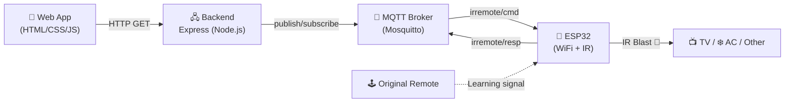

<div align="center">

# 📡 IR Remote

### Control your home appliances with infrared, from anywhere in the world

**ESP32 · MQTT · Node.js · Sleek Persian (RTL) Web App**

[](.)
[](.)
[](.)
[](LICENSE)

[🌐 Live Demo](https://iot-irremote.ir/)

</div>

---

## 🎯 What is this?

**IR Remote** turns an ESP32 board into a full-fledged, internet-connected universal remote. A clean, mobile-friendly web app lets you control your TV, air conditioner, or any other infrared device — from inside the house or from anywhere on Earth — with no proprietary app and no expensive hub required.

The standout feature is **IR code learning**: point your original remote at the receiver, press a button, and the ESP32 captures the signal, figures out the protocol, and stores it permanently — even for non-standard remotes.

## ✨ Features

- 📱 **Persian (RTL) web interface** with devices organized by category (TV, AC, Other)
- 🌐 **True remote control** over MQTT — not just local-network control
- 🎓 **Learn any IR code with no coding** — clone any remote in a few seconds
- 💾 **Persistent storage** of learned codes on the ESP32's flash (`Preferences`)
- 🔌 **Multi-protocol support**: NEC, Samsung, Sony, RC5, LG, Sharp, Panasonic, Philips
- ⚡ **Lightweight Express backend** acting as the bridge between the website and the ESP32
- 🖥️ **Deployment-ready** with a ready-to-use Nginx config

## 🏗️ System Architecture



Here's how a request flows through the system:

1. The user taps a button in the web app (e.g. "Power")
2. An HTTP request hits the Express backend
3. The backend publishes a message on the `irremote/cmd` topic and waits for a reply on `irremote/resp` (with a 5-second timeout)
4. The ESP32, subscribed to the MQTT broker, receives the command, transmits the correct IR signal for that protocol, and sends the result back

## 🔧 Wiring Diagram

<div align="center">

</div>

The circuit is built around three parts on the breadboard:

- **IR receiver** (3-pin sensor, left) — captures signals from your original remotes during Learn Mode. Wired to `3V3`, `GND`, and a digital input pin (`IR_RECV_PIN`, GPIO14 in the firmware).
- **NPN transistor + resistors + IR LED** (right side) — the transmitter stage. The board's digital output pin (`IR_SEND_PIN`, GPIO4 in the firmware) drives the transistor's base through a resistor, which switches the IR LED to blast the signal, with a second resistor limiting LED current.
- **Common ground rail** ties the board, receiver, and transmitter stage together.

> ⚠️ Double-check that the receiver's OUT pin and the transistor's base line up with `IR_RECV_PIN` / `IR_SEND_PIN` as defined at the top of `firmware/main.ino` before powering on — pinouts vary between IR receiver/transistor models.

## 📂 Project Structure

```
IR-Remote/
├── docs/
│   └── wiring-diagram.png  # Fritzing breadboard diagram
├── firmware/
│   ├── main.ino             # ESP32 main sketch — WiFi, MQTT, IR send/receive, learning
│   └── ir_codes.h            # Device, button, and IR protocol definitions
├── backend/
│   ├── server.js              # Express server bridging the website to the ESP32 over MQTT
│   ├── package.json
│   └── nginx-irremote.conf    # Ready-to-use Nginx config for serving the frontend
└── frontend/
    ├── index.html              # Page structure (RTL)
    ├── style.css                # Full UI styling
    └── app.js                    # Client logic: device listing, sending commands, learning
```

## 🧰 Requirements

| Item | Notes |
|---|---|
| Board | ESP32 (any WiFi-capable variant) |
| IR transmitter | IR LED wired through a transistor stage on `GPIO4` |
| IR receiver | IR receiver module on `GPIO14` (used for learning) |
| Arduino libraries | `IRremoteESP8266` (or equivalent `IRsend`/`IRrecv`/`IRutils`), `PubSubClient`, `ArduinoJson`, `Preferences` |
| Server | A Linux host with Node.js ≥ 18 and an MQTT broker (Mosquitto recommended) |

## 🚀 Getting Started

### 1. Flash the ESP32

Open `firmware/main.ino` in the Arduino IDE and replace these values with your own:

```cpp
const char* WIFI_SSID  = "WIFI_SSID";
const char* WIFI_PASS  = "WIFI_PASS";
const char* MQTT_HOST  = "IP_Host";   // IP address of the server running Mosquitto
```

Then wire the circuit as shown in the [wiring diagram](#-wiring-diagram) above, define your devices/buttons in `firmware/ir_codes.h`, and upload the sketch.

### 2. Set up the MQTT broker

```bash
sudo apt install mosquitto mosquitto-clients
sudo systemctl enable --now mosquitto
```

### 3. Run the backend

```bash
cd backend
npm install
npm start        # starts on http://127.0.0.1:3001
```

### 4. Serve the frontend

Point the frontend at your backend by editing `frontend/app.js`:

```js
const ESP32_URL = 'http://<your-server-ip-or-domain>';
```

For a production deployment, use the provided Nginx config:

```bash
sudo cp backend/nginx-irremote.conf /etc/nginx/sites-available/irremote
sudo ln -s /etc/nginx/sites-available/irremote /etc/nginx/sites-enabled/
sudo cp -r frontend/* /var/www/irremote/
sudo nginx -t && sudo systemctl reload nginx
```

...or just open `frontend/index.html` directly for a quick local test.

## 🎓 Learning a New Button

1. In the web app, open the target device and tap **📡 Learn**
2. Select the button you want to add
3. Point the original remote at the IR receiver and press the matching button
4. Within 15 seconds, the ESP32 detects the signal, identifies the protocol, and stores it permanently ✅

## 🔌 Backend API

| Method | Endpoint | Description |
|---|---|---|
| `GET` | `/devices` | List all configured devices and buttons |
| `GET` | `/ir?device=&btn=` | Send a specific IR command |
| `GET` | `/learn/start?device=&btn=` | Start learning mode for a button |
| `GET` | `/learn/status` | Get current learning status (waiting / success / timeout) |
| `GET` | `/learn/cancel` | Cancel the current learning session |
| `GET` | `/learn/delete?device=&btn=` | Delete a previously learned code |

## 🗺️ Roadmap

- [ ] Authentication for remote access (auth tokens)
- [ ] End-to-end HTTPS/WSS support
- [ ] A scheduler for automated commands
- [ ] Voice assistant integration (Google Assistant / Alexa)

## 🤝 Contributing

Pull requests are very welcome! Feel free to open an issue or send a PR directly with any improvements.

## 📄 License

This project is released under the [MIT](LICENSE) license.

---

<div align="center">
Built with ❤️ and a lot of IR-signal debugging 📡
</div>
